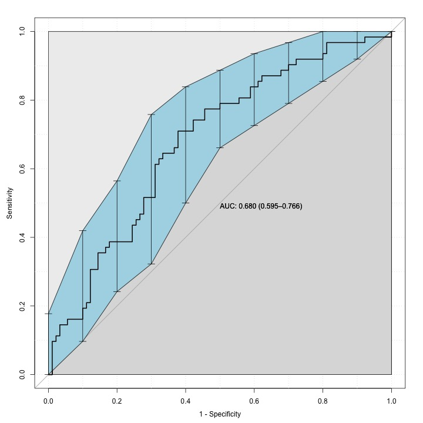
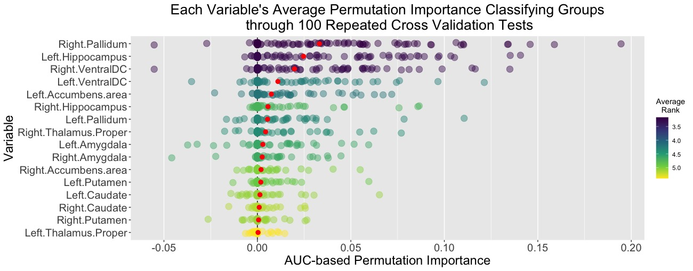

# Classification of Groups using Gradient Boosting

Gradient boosted classifiers were able to reliably predict the group status of unsees test-set subjects using subcortical grey matter volume (adjusted for age, sex, and total *cortex* volume).

Gray matter volume in the right pallidum, left hippocampus, and bilateral diencephalon proved most informative in predicting group status.

