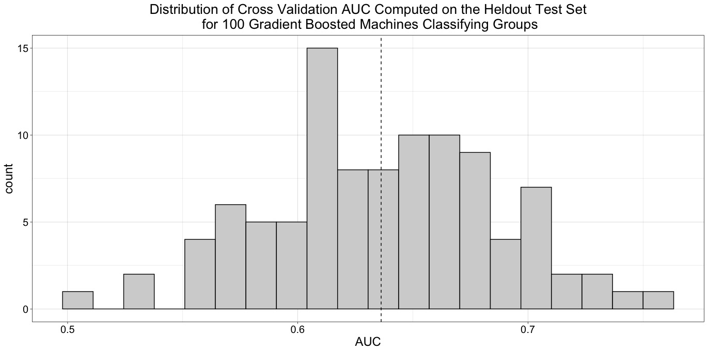
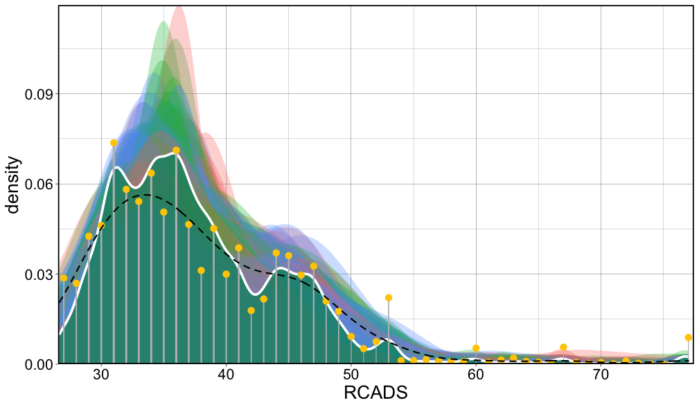

# Classification of Groups using Gradient Boosting

Gradient boosted classifiers were able to reliably predict the group status of unsees test-set subjects using subcortical grey matter volume (adjusted for age, sex, and total *cortex* volume).

Gray matter volume in the Left Hippocampus, Right Pallidum, and Right Ventral Diencephalon proved most informative in predicting group status.

# CBCL pipeline

The CBCL internalizing, externalizing, and total subscales were predicted through random forest regression by the volume of subcortical brian regions.
## Findings

# RCADS predictive modeling
## Highlights
### Random Forest distributions

Distributions of RCADS total *t*-score predictions generated from individual trees built on bootstrap resamples of the data. The prediction from the random forest is outlined in white and masked in green, while the dashed black line represents the true distribution of RCADS scores. Semi-transparent density curves reflect the predictions of individual trees. Yellow dots indicate the density of the predicted value at each tree's terminal nodes, as does the thickness of its corresponding grey bar (terminal branch).

### Variable importances
`source('Scripts/misc/vimPlot.R')`

These are the most explanatory variables in predicting RCADS from the functional connections between (Harvard-Oxford) parcels in the brain (functional connectivity matrices). Overall, 20% of the variance is explained by the random forest model. *Generate this plot using `vimPlot.R`*

The following plot provides the variable importances of all features in the RF predicting RCADS from structural MRI volumes. 

